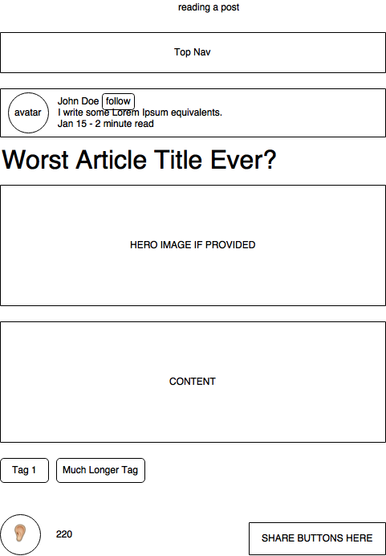

# Communique

[Communique live][heroku]

[heroku]: http://www.herokuapp.com

Communique is a web application inspired by Medium built using Ruby on Rails
and React/Redux.  It utilizes Ruby on Rails on the backend, a PostgreSQL database, and React.js with a Redux architectural framework on the frontend.  

## Features & Implementation

Communique allows users to post messages with rich text editing that can be viewed and shared by other users. A user can be followed to be shown their new posts in the feed. Tags can be added to posts and followed in the feed. A user can say they 'heard' the message someone else posted; the amount of times a post was heard will show up on the post.

### Post Rendering and Editing

  Posts are stored in a DB table with columns `id`, `author_id`, `content`, and `updated_at`. There will be join tables between posts and tags, as will as for a post being heard by a user.

  Posts are rendered in the `PostContainer` component.

Post editing is implemented using the Quill.js library, allowing for a Word-processor-like user experience.

<!-- TODO: the rest -->
